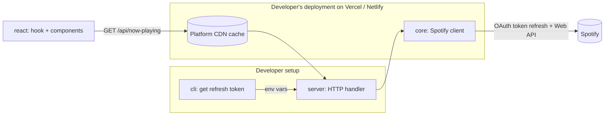

# playstate — Architecture

> **Status:** Draft · **Version:** v1 · Decisions referenced here are recorded in [`docs/adr/`](./docs/adr/).
> Packages are published under the `@playstate` npm organization. Repository: `github.com/dreweloper/playstate`.

## 1. Purpose

**playstate** is a toolkit that lets developers show what they are currently listening to on Spotify on their own websites, without dealing with OAuth, token refresh or the quirks of the Spotify Web API.

It has two goals:

1. **Library:** a typed, tested toolkit that any developer can self-host in minutes. Its library packages have no third-party runtime dependencies.
2. **Portfolio:** a showcase of architecture, developer experience and engineering practices.

### Non-goals (v1)

- Showing other users' listening activity (single-account, self-hosted only).
- Playback control of any kind.
- A hosted/central service operated by the author.
- Non-React UI packages (non-React users can consume the endpoint's JSON directly).
- Deployment targets other than Vercel and Netlify (see section 10).

Ideas outside v1 live in `ideas-v2.md`.

## 2. Overview



1. The developer runs the **cli** once to obtain a Spotify refresh token.
2. The developer deploys the **server** handler with their credentials as environment variables.
3. The **server** uses **core** to fetch and normalize data from Spotify, and responds with cache headers.
4. The **react** package polls the endpoint URL. It has no knowledge of any CDN: the hosting platform places its CDN in front of the function, and the cache headers let the CDN answer repeated requests without invoking the function or calling Spotify.

## 3. Packages

| Package | Responsibility | Runs in | Published |
|---|---|---|---|
| `@playstate/core` | Token refresh, Spotify API calls, normalization into the `NowPlaying` model | Server | Yes |
| `@playstate/server` | Web-standard HTTP handler: caching, CORS, error mapping, rate-limit protection | Server | Yes |
| `@playstate/cli` | One-time OAuth flow to obtain a refresh token | Developer's machine | Yes, as an executable (`bin`) |
| `@playstate/react` | `useNowPlaying` hook, headless components, styled card | Browser | Yes |

### 3.1 `core`

- Exposes `createSpotifyClient(config)` returning `getNowPlaying(): Promise<NowPlaying>`.
- Config: `clientId`, `clientSecret`, `refreshToken`.
- Uses only the native `fetch` API. No runtime dependencies. Tests mock the network with MSW (`msw/node`), so no fetch injection is needed.
- **Access token caching:** the access token (valid for one hour) is stored with its expiry in a module-level variable and reused until 60 seconds before it expires. The cache lives as long as the serverless instance stays warm. Each instance has its own cache, and a cold start simply triggers a new refresh. This is an optimization, not a requirement.

### 3.2 `server`

- Exposes `createNowPlayingHandler(config): (req: Request) => Promise<Response>`.
- Its config is a superset of the `core` config: the handler creates the Spotify client internally, so developers configure everything in a single call.

```ts
createNowPlayingHandler({
  // Passed to core
  clientId,
  clientSecret,
  refreshToken,
  // Server options (optional)
  allowedOrigins: ['https://example.dev'],
  cache: { sMaxAge: 10, staleWhileRevalidate: 30 },
});
```

**CORS**

- Disabled by default: no CORS headers are sent, so only same-origin requests work from browsers (principle of least privilege).
- `allowedOrigins` enables cross-origin access explicitly. The handler compares the request's `Origin` header against the list and, on a match, echoes it in `Access-Control-Allow-Origin`, always adding `Vary: Origin` so the CDN does not serve one origin's cached response to another.
- `OPTIONS` preflight requests are handled.
- CORS is not access control: it is enforced only by browsers. The endpoint is public by design and its data is intentionally public.

**Cache overrides**

- `cache` lets developers adjust the default values (section 8), e.g. raise them to reduce Spotify calls on high-traffic sites, or disable caching.

### 3.3 `cli`

- Executed via `npx`. Prompts for `clientId` and `clientSecret` (or reads them from args/env).
- Starts a local server on `http://127.0.0.1:8888/callback` (Spotify requires the loopback IP, not `localhost`).
- Requests only the scopes `user-read-currently-playing` and `user-read-recently-played`.
- Uses a random `state` parameter (CSRF protection), exchanges the code for tokens, prints the refresh token and optionally writes it to `.env.local`, warning if that file is not git-ignored.
- Shuts the local server down after completion.

### 3.4 `react`

Three levels of abstraction, each built on the previous one:

1. **`useNowPlaying({ endpoint, interval })`**: fetches data from the endpoint (never from `core` directly). For fully custom UIs.
2. **Headless components**: `Root` calls the hook and shares state through context; child components read from it and expose state via `data-*` attributes. No styles.
3. **`NowPlayingCard`**: styled component built on the headless layer. Styles are written with CSS Modules and compiled at build time into a single optional stylesheet (`@playstate/react/styles.css`). Theming happens through CSS custom properties (`--playstate-*`) and `data-*` attributes, which form the public styling API (ADR-0011).

Headless components are exported individually (`Root`, `Cover`, `Title`, `Artists`…) and consumed through a namespace import, following the Radix pattern:

```tsx
import * as NowPlaying from '@playstate/react';

<NowPlaying.Root endpoint="/api/now-playing">
  <NowPlaying.Cover />
  <NowPlaying.Title />
</NowPlaying.Root>
```

This keeps the `NowPlaying.X` syntax while remaining compatible with React Server Components (property access on client components from server components is problematic) and tree-shakeable.

The final list of components depends on the UI design (pending).

- Ships with a `"use client"` directive.
- React ≥ 18 as a peer dependency. No other runtime dependencies.

## 4. Dependency rules

```
core   ← server   (runtime import)
core   ← react    (type-only import, types inlined at build time)
cli               (independent)
```

- **`react` must never import runtime code from `core` or `server`.** This guarantees that secrets and server logic cannot reach the browser bundle. Enforced in CI by a check that fails if the `react` build output contains `accounts.spotify.com` or `client_secret`.
- The types `react` uses from `core` are inlined into its declaration files at build time, so consumers of `react` do not install `core`.
- Library packages (`core`, `server`, `react`) have **no third-party runtime dependencies**. The only internal runtime dependency is `server` → `core`; `react` has none (React is its only peer dependency, and `core` types are inlined at build time). The CLI may use a minimal set of dependencies, listed in `CONVENTIONS.md` section 10 (ADR-0012).

## 5. Data model

The public contract. Spotify's raw responses never leave `core`.

```ts
type MediaItem = {
  type: 'track' | 'episode';
  title: string;
  artists: string[];       // for episodes: the show name
  album: string;           // for episodes: the show name
  imageUrl: string | null; // null for local files
  url: string | null;      // link back to Spotify; null for local files
  durationMs: number;
};

type NowPlaying =
  | { status: 'playing'; item: MediaItem; progressMs: number }
  | { status: 'paused';  item: MediaItem; progressMs: number }
  | { status: 'recent';  item: MediaItem; playedAt: string }
  | { status: 'offline' };
```

- `progressMs` and `durationMs` are included because Spotify provides them at no cost. Whether the UI displays progress is a UI design decision (pending).
- Fields intentionally excluded: user ID, device name/type, context (playlist), market data.

## 6. State resolution

**Principle:** if the `currently-playing` response contains a usable item, it is used (`playing` or `paused` depending on `is_playing`). Otherwise, `core` falls back to `recently-played` (`recent` if it returns an item, `offline` if not).

A **usable item** is a track or an episode with an `item` object present. Requests include `additional_types=episode` so podcasts are returned.

Known cases, to be specified as acceptance criteria and tests in the corresponding issue:

| Case | Expected |
|---|---|
| `200`, track or episode, `is_playing: true` | `playing` |
| `200`, track or episode, `is_playing: false` | `paused` |
| `200`, `item: null` (regardless of `is_playing`) | Fallback |
| `200`, `currently_playing_type: "ad"` or `"unknown"` | Fallback |
| `200`, local file (`is_local: true`) | `playing`/`paused` with `imageUrl` and `url` set to `null` |
| `204` (no content) | Fallback |

## 7. Error model

| Error (`core`) | Cause | `server` response |
|---|---|---|
| `ConfigError` | Missing or invalid configuration | `500` |
| `AuthError` | Refresh token invalid or revoked | `502` |
| `RateLimitError` | Spotify `429`; carries `retryAfter` (seconds) | `503` + `Retry-After` |
| `SpotifyApiError` | Other non-OK upstream responses (e.g. `5xx`) | `502` |

- Error responses never include secrets or raw upstream bodies.
- Error responses are not cached, **except rate limiting** (below).

**Rate-limit handling**

1. `core` throws `RateLimitError` with the `Retry-After` value from Spotify.
2. `server` stores "blocked until T" in memory and, until T, responds `503` without calling Spotify.
3. The `503` response carries `Retry-After` and is cacheable by the CDN for that duration, so requests stop reaching the function.
4. The `react` hook reads `Retry-After` and delays its next poll accordingly instead of using the normal interval.

With CDN caching in place, reaching Spotify's rate limit is unlikely; this ensures that, if it happens, the system backs off instead of making it worse.

## 8. Caching and polling

- **Server:** successful responses use `Cache-Control: public, s-maxage=10, stale-while-revalidate=30` (overridable, section 3.2). `s-maxage` applies only to shared caches (the CDN), not to browsers. Upstream calls stay bounded regardless of traffic (≈ 6 per minute per deployment).
- **Client:** polling with chained `setTimeout` (default interval: 15 s, since polling faster than the CDN cache adds no freshness), paused while the tab is hidden, immediate refetch when it becomes visible, and `AbortController` on unmount.
- Platform-specific caching behavior (e.g. `Vary` handling, platform-specific headers) is validated per platform during the `server` phase. Local dev servers may not emulate the CDN cache.

## 9. Security

Summary (full threat model in `SECURITY-MODEL.md`):

- Minimal scopes: read-only access to current and recent playback.
- Self-hosted: credentials live only in the developer's environment variables. The author operates no service and never has access to tokens.
- Secrets cannot reach the browser by design (section 4), verified in CI.
- Data minimization (section 5).
- Data from Spotify is treated as untrusted when rendered: text is never injected as HTML, and links and images are only rendered for `https` URLs.
- CORS disabled by default (section 3.2).
- Published from CI with npm provenance.

## 10. Platform support

- **Deployment targets (v1):** Vercel and Netlify, both documented, with examples and verified caching behavior. The handler is web-standard and may run on other runtimes, but they are not officially supported in v1.
- **Server runtime:** Node ≥ 22 (supported LTS lines). Development uses an LTS line (currently Node 24), pinned in `.nvmrc`.
- **React package:** React ≥ 18; compatible with React Server Components frameworks as a client component.
- **Output:** library packages (`core`, `server`, `react`): ESM and CJS with TypeScript declarations. `cli`: ESM only, since it is run as a `bin` through `npx` and is never imported.

## 11. Tooling

pnpm workspaces · TypeScript (strict) · tsdown · Vitest · MSW · React Testing Library · Storybook · CSS Modules · ESLint + Prettier · Stylelint · Changesets · GitHub Actions · publint · @arethetypeswrong/cli

## 12. Related decisions

- ADR-0001 — Package naming and Spotify branding
- ADR-0002 — Monorepo with four packages
- ADR-0003 — Web-standard `Request`/`Response` handler
- ADR-0004 — Zero runtime dependencies (superseded by ADR-0012)
- ADR-0005 — Types from `core` inlined into `react` at build time
- ADR-0006 — CDN caching strategy
- ADR-0007 — Custom polling instead of TanStack Query/SWR
- ADR-0008 — CORS disabled by default with explicit origin allowlist
- ADR-0009 — v1 deployment targets: Vercel and Netlify
- ADR-0010 — Namespace exports for headless components
- ADR-0011 — CSS Modules for styled components
- ADR-0012 — No third-party runtime dependencies

## 13. Pending and deferred

**Pending UI design (v1):** final component list, progress display and local progress interpolation.

**Deferred to v2 (`ideas-v2.md`):** Cloudflare Workers support (requires its Cache API), injectable custom `fetch` in `core`.
